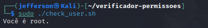
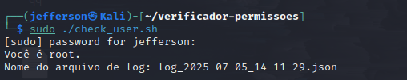
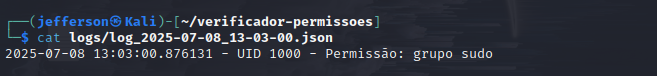

# ---- Projeto: Verificador de Permissões com log de Execução - Versão 3 _____

# Versão atual: Refatorada e profissional - suporte a JSON, argparse, verificação de grupo e logs dinâmicos

# ---- Objetivo ------

# Este projeto verificar se um usuário possui privilégios de administrativos (root) antes de execultar tarefas críticas. Ele registra cada execução em um arquivo de log e , agora na versão 3, também em formato JSON, com possibilidade de personalização de nome do log e envio simulado via API (logger).

# ---- Tecnologias Ultilizadas -----

# - shell script (bash)
# - Python 3
# - Json
# - Argparse
# - Estrutura modular (util/)
# - Teste com unittest
# - Git + GitHub

# ---- Novidades da versão 3 -----

# - Argumentos via terminal com argparse 
# - Log de execução em formato JSON
# - Verificação se o usuario está no grupo sudo 
# - CLI com opções como JSON, LOG, VERBOSE
# - Esrutura de projeto modular e organizada
# - Pronto para expansão e teste automatizados

# ----- Estrutura do projeto ----

# - bash
# - verficador-permissões/
# |--check.py                         # script principal
# |--check_user.sh                    # script shell facilitador 
# |--registro.log                     # log padão em texto
# |--logs/                            # logs personalizados 
# | --- log_2025-07-05_11-30.json        
# |--imagens/                         # prints de execução
# | --- v3/  
# |--utils/                           # módulos auxiliares (ex logger.py)
# |--test/                            # testes automatizados
# | --- test/                        
# |--README.md                        # documentação
# ---- Como Usar -----

# ---- Pré-requisitos -----

# - Python 3 instalado
# - Um ambiente baseado em unix (Linux, macOS)

# ---- Executando -----

# 1. Dê permissão de execução para o script:

#    chmod +x check_user.sh

# 2. Depois é só rodar:

#   ./check_user.sh

# 3. Rodar manualmente com argumetos 

#   python3 check.py --log logs/meu_log.json --json --verbose 

# 4. Verificador logs

#   cat registro.log
#   cat logs/meu_log.json | jq 

# --- Histórico de Vesões ----

# - Versão 1: Lógica básica com log padrão

# - Checagem de root
# - Log em registro.log
# - sem argumentos

# --- Vesão 2: Argumentos via terminal + JSON ---

# - Recebe nome do log como argumento (sys.argv)
# - Suporte a log JSON com --json
# - criação dinânica de pasta(logs/)
# - prints de execução incluído
# - Estrutura modular 
# - preparado para expansão

# --- Versão 3: Testes automatizados ---

# - Verificação de grupo admin
# - Envio de log via API
# - CLI completa com argparse (--log, --json, --verbose)
# - Teste automático (pytest)
# --- Execução Real - versão 1 ------

# imagens tiradas durante a execução do primeiro projeto.

# --- Estrutura de arquivos -----

# --- Conteúdo do script 'check.py' ----

# --- Execução como Usuário Normal ----

# --- Execução como root (sudo) -----

# --- Visualização do log Gerado ----

# --- Estrutura com o comando tree ----

# --- Execução Real - versão 2 ------

# imagens tiradas durante a execução do versão 2 do projeto.

# ------ Estrutura de Arquivos -----

# ------ Conteúdo do Script `check.py` ----

# ------ Execução como Usuário Normal -----

# ------ Execução como root (sudo) ------

# ------ Log Gerado -----

# ------ Estrutura com `tree` ------

# --- Execução Real - versão 3 ------

# imagens tiradas durante a execução do versão 3 do projeto.

# ------ Estrutura de Arquivos -----

# ------ Conteúdo do Script `check.py` ----

# ------ Execução como Usuário Normal -----

# ------ Execução como root (sudo) ------

# ------ Log JSON -----

# ------ Estrutura com `tree` ------

# --- Licença ---

# MIT- Sinta-se livre para usar, modificar e contribuir! 
